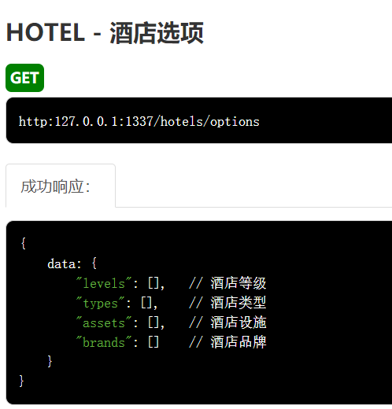
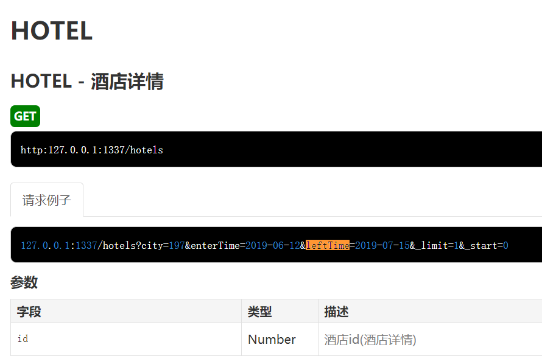
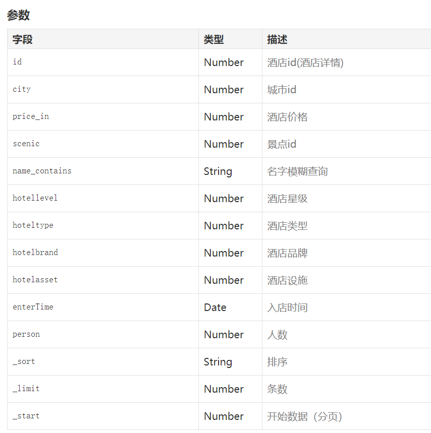

## 酒店页面：

### 1.初步筛选：城市，日期，人数  

### 2.进步筛选：酒店价格，星级，类型，设施，品牌

> **http:127.0.0.1:1337/hotels    酒店详情**
>
> 实例： 127.0.0.1:1337/hotels?city=197&enterTime=2019-06-12&leftTime=2019-07-15&_limit=1&_start=0 
>
>  **http:127.0.0.1:1337/hotels/options   酒店选项**   应用于酒店筛选中
>
>  http:127.0.0.1:1337/cities    查找城市   应用于  scenics: [] // 景点，展示在酒店的搜索的区域位置 
>
>  http:127.0.0.1:1337/airs/city   实时机票城市

进入页面获取插件定位的城市

放到url

获取url,根据城市名获取id

渲染酒店列表，标记，区域，

点击查看价格时渲染

定位坐标：选择好城市，根据城市选择区域 location 的坐标 latitude ， longitude 

 setCity(city:String，callback:Functon)    按照行政区名称或adcode来设置地图显示的中心点。 

  **this**.map.setFitView();  根据地图上添加的覆盖物分布情况，自动缩放地图到合适的视野级别，参数均可缺省。 

## 

